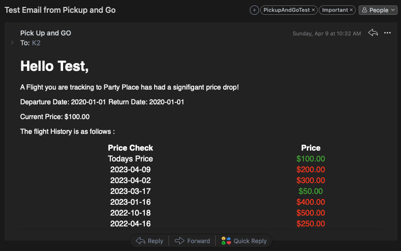
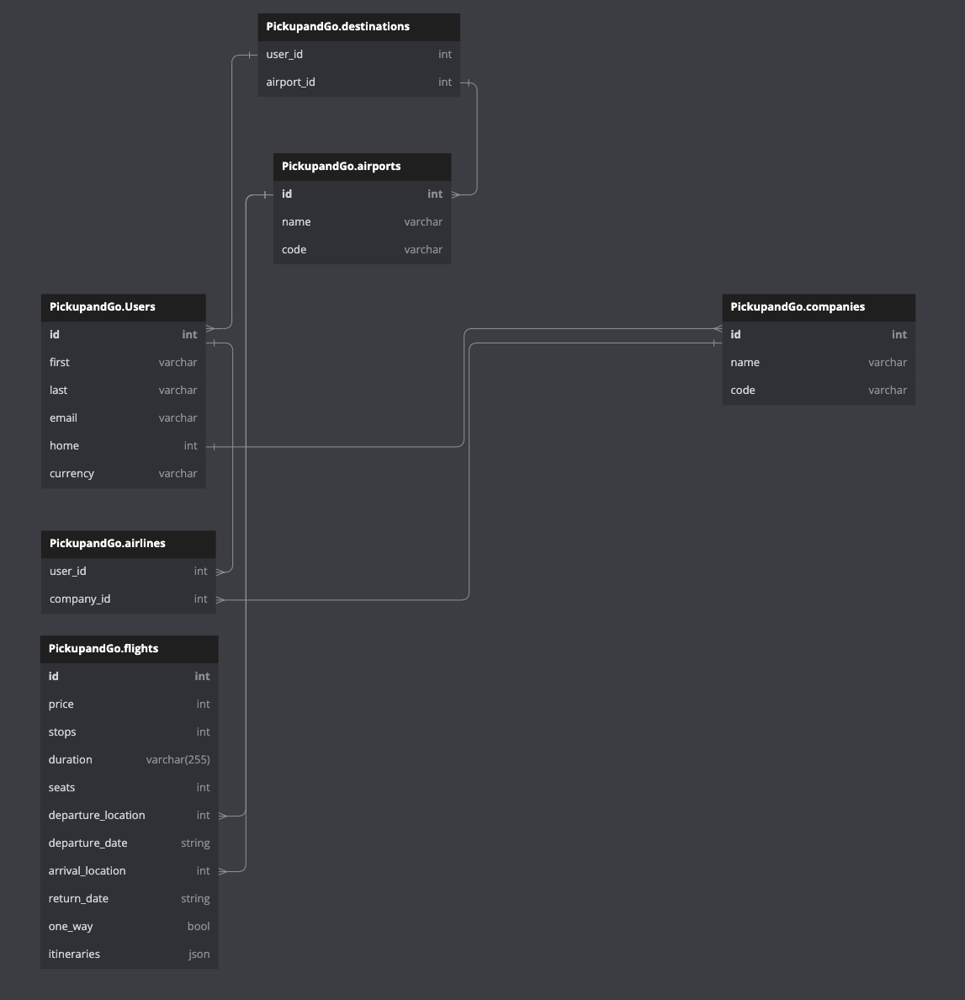

# PickUpandGO

## About

PickUpandGO is a mix between a client and a web app.
The application takes data from the user including their name, email, home airport, and destination airports. It then begins collecting data from the Amadeus api for upcoming pricing on flights. It will then notify the user via email when a price drops to below the average history.

## Tools Used

-   GoLang 1.19 Application
    -   Using the folowing Dependencies
        -   github.com/robfig/cron/v3
        -   github.com/go-sql-driver/mysql
        -   github.com/joho/godotenv
        -   github.com/gorilla/mux
    -   Hosted on a Droplet
-   MySQL
    -   Hosted on Digital Ocean - Database Cluster
    -   6 tables with interdependencies - Foreign key relations
-   Amadeus Flight API
    -   Specifically: `/v2/shopping/flight-offers`
    -   Response example data found in `extras/example.txt`
-   Sendgrid Email Service

## How to sign up

I am not currently accepting new users. However, if you are interested, please fill out this [link](https://forms.gle/XWtHXML2poKSxK6p6).

## Snippets

